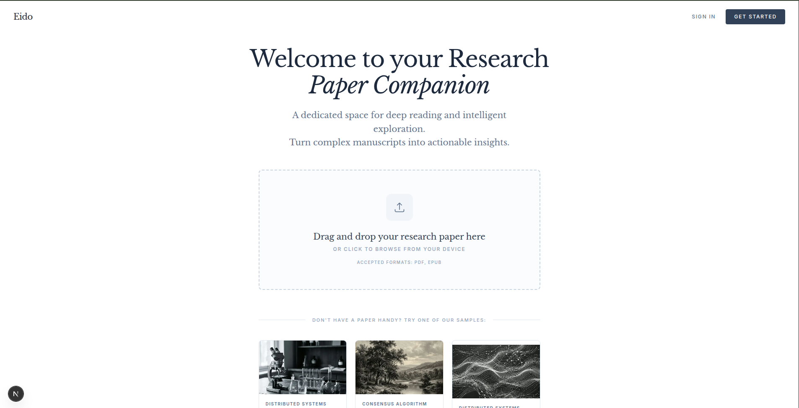
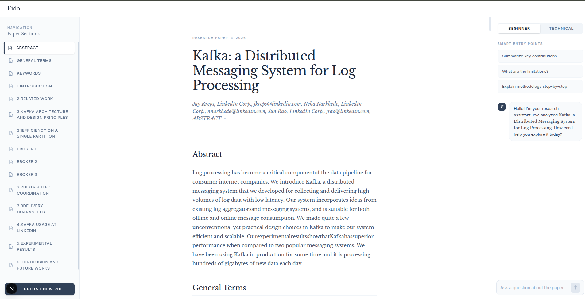

# Eido: Research Paper Companion




## What I Built
Eido is an intelligent, context-aware research paper reading environment built with Next.js. It allows users to upload PDF research papers and parses the document text directly in the browser. 

Once a paper is loaded, the application provides a three-panel interface:
1. A navigation sidebar linking to extracted sections.
2. A clean, distraction-free document viewer.
3. An AI-powered research assistant chatbot.

The chatbot is strictly grounded in the content of the uploaded paper. It offers two distinct modes: "Beginner" (providing simplified explanations and analogies) and "Technical" (delivering precise, domain-specific insights). This allows users to query complex concepts natively while avoiding generalized AI hallucinations. 

## Why I Built It
I picked this topic because I recently read the original Apache Kafka research paper. I spent a significant amount of time trying to understand the paper in depth, break down its architecture, and summarize its overarching contributions. 

Going through that intensive learning process made me realize how valuable it would be to have a dedicated, focused tool designed specifically for exploring and querying dense academic literature. Eido was built to solve the exact problem of actively parsing, understanding, and breaking down tough research papers seamlessly.

## Getting Started

To run the development server locally:

```bash
npm run dev
# or
yarn dev
# or
pnpm dev
```

Ensure you have your environment variables configured (e.g., `OPENROUTER` key) to enable the AI assistant functionality. Open http://localhost:3000 in your browser to start exploring papers.
